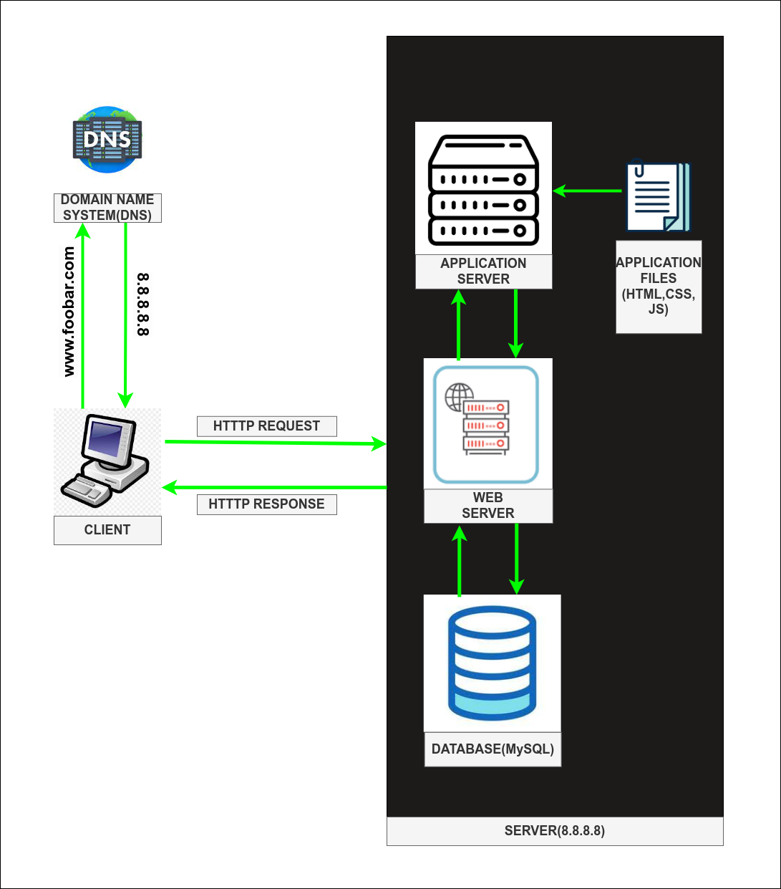

Distributed Web Infrastructure

A distributed web infrastructure is designed to handle high traffic loads, provide scalability, and ensure fault-tolerance by distributing the workload across multiple servers. Instead of relying on a single server, the infrastructure involves a cluster or network of interconnected servers working together to serve the website.

Let's design a distributed web infrastructure for the domain www.foobar.com:

1. Load Balancer:
We introduce a load balancer, which acts as a traffic distributor. It sits between the users and the servers and evenly distributes incoming requests across multiple servers based on various algorithms like round-robin, least connections, or weighted distribution. The load balancer ensures that no single server becomes overwhelmed and improves the overall performance and availability of the website.

2. Multiple Servers:
We have a cluster of multiple servers, such as Server A, Server B, and Server C. These servers work together to handle incoming requests and serve website content. Each server is configured similarly and hosts the necessary software components.

3. Web Servers:
On each server, we install and configure web server software, such as Nginx or Apache. These web servers handle incoming HTTP requests, serve static files, and act as reverse proxies to forward dynamic requests to the appropriate application servers. The load balancer distributes requests across these web servers.

4. Application Servers:
Each server in the cluster runs an application server that executes the website's code base. These application servers process dynamic requests, execute business logic, and generate responses. They communicate with the database to retrieve or store data. The load balancer ensures that requests are distributed evenly among the application servers.

5. Database (MySQL):
We have a dedicated database server, such as Server D, running MySQL. This server manages the website's data and provides data storage and retrieval services to the application servers. The application servers connect to the database server to interact with the database and perform necessary operations.

6. Domain Name (foobar.com) and www Record:
The domain name foobar.com is configured with DNS records. In this case, we create an A record for the www subdomain pointing to the IP address of the load balancer. When users enter www.foobar.com, the DNS resolves the IP address of the load balancer, ensuring their requests are directed to the distributed infrastructure.

Example:

1. A user enters www.foobar.com in their web browser.
2. The DNS resolver resolves www.foobar.com to the IP address of the load balancer.
3. The user's request reaches the load balancer.
4. The load balancer, based on its configured algorithm, distributes the request to one of the available web servers (Server A, B, or C).
5. The selected web server receives the request and processes it.
6. If the request requires dynamic processing, the web server forwards it to one of the available application servers.
7. The application server executes the corresponding code and interacts with the database server, if necessary, to generate the response.
8. The response is sent back to the web server, which delivers it to the user's computer.
9. The user sees the website's content displayed in their web browser.

Benefits of a distributed web infrastructure:
- Scalability: Additional servers can be easily added to the cluster to handle increased traffic, ensuring the website can scale as needed.
- High Availability: If one server fails, the remaining servers continue to handle requests, preventing downtime and improving fault-tolerance.
- Load Distribution: Incoming traffic is evenly distributed across multiple servers, preventing any single server from becoming overwhelmed and ensuring optimal performance.
- Redundancy: Multiple servers provide redundancy, reducing the risk of a single point of failure and improving the overall reliability of the infrastructure.

By implementing a distributed web infrastructure, the website can handle high traffic loads, provide scalability, and maintain availability even in the face of server failures or increased demand.
