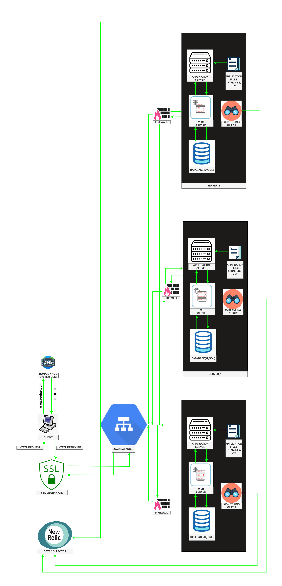

Secured and Monitered Web Infrastructure

1. Additional Elements:
Each additional element in the infrastructure serves a specific purpose to enhance its functionality. For example:
- Load balancer: It distributes incoming traffic evenly across multiple servers, ensuring better resource utilization and preventing any single server from being overwhelmed.
- Firewalls: They are added to enforce security policies by controlling incoming and outgoing network traffic, protecting the infrastructure from unauthorized access and potential attacks.
- HTTPS: It encrypts the communication between the web server and the user's browser, ensuring the confidentiality and integrity of data transmitted over the network.

2. Firewalls:
Firewalls are essential for network security. They act as a barrier between the internal network (servers) and external networks (users or other networks). Firewalls monitor and control incoming and outgoing network traffic based on predefined rules, allowing only authorized traffic to pass through and blocking potentially harmful or malicious traffic.

3. HTTPS:
HTTPS (Hypertext Transfer Protocol Secure) encrypts the communication between the web server and the user's browser using SSL/TLS certificates. It ensures that sensitive information, such as login credentials or payment details, remains encrypted and protected from eavesdropping or tampering by unauthorized individuals. HTTPS is important to maintain data privacy and security during transmission.

4. Monitoring:
Monitoring is used to track the health, performance, and availability of the infrastructure components. It involves collecting and analyzing data related to server metrics, resource utilization, response times, error rates, and more. Monitoring helps identify issues, bottlenecks, or abnormal behavior, allowing administrators to take proactive measures to ensure the smooth operation of the infrastructure.

5. Monitoring Tool and Data Collection:
A monitoring tool collects data by periodically querying the infrastructure's components for relevant metrics. It can use various methods such as agent-based monitoring, SNMP (Simple Network Management Protocol), API integrations, or log parsing. The collected data is then processed, stored, and presented in a monitoring dashboard or alerting system for analysis and visualization.

6. Monitoring Web Server QPS:
To monitor the web server's QPS (Queries Per Second), you can configure the monitoring tool to track the number of incoming requests over a specific time period. The monitoring tool can collect data on request counts, response times, and other relevant metrics. By analyzing this data, you can understand the traffic patterns, identify peak usage periods, and ensure the web server can handle the expected load.

Issues with the infrastructure:

1. Terminating SSL at the load balancer level:
Terminating SSL at the load balancer means decrypting the incoming HTTPS traffic before distributing it to the backend servers. This can be an issue if sensitive data needs to be transmitted securely between the load balancer and backend servers. If the communication between the load balancer and servers is not adequately protected, there is a risk of data interception or unauthorized access.

2. Single MySQL server accepting writes:
Having only one MySQL server capable of accepting writes creates a single point of failure. If the MySQL server fails, write operations will be affected, potentially causing data loss or downtime. It is recommended to implement database replication or clustering to ensure high availability and data redundancy.

3. Identical components on servers:
Having servers with identical components (database, web server, and application server) might be problematic in terms of resource allocation and scalability. If one component, such as the database, requires more resources or becomes a performance bottleneck, it could impact the entire server. In a distributed infrastructure, different components can be scaled independently based on their specific needs, optimizing resource allocation and overall system performance.

Addressing these issues involves implementing appropriate measures such as using secure communication channels between load balancer and servers, setting up database replication or clustering for high availability, and considering a more flexible architecture that allows component-specific scalability.
