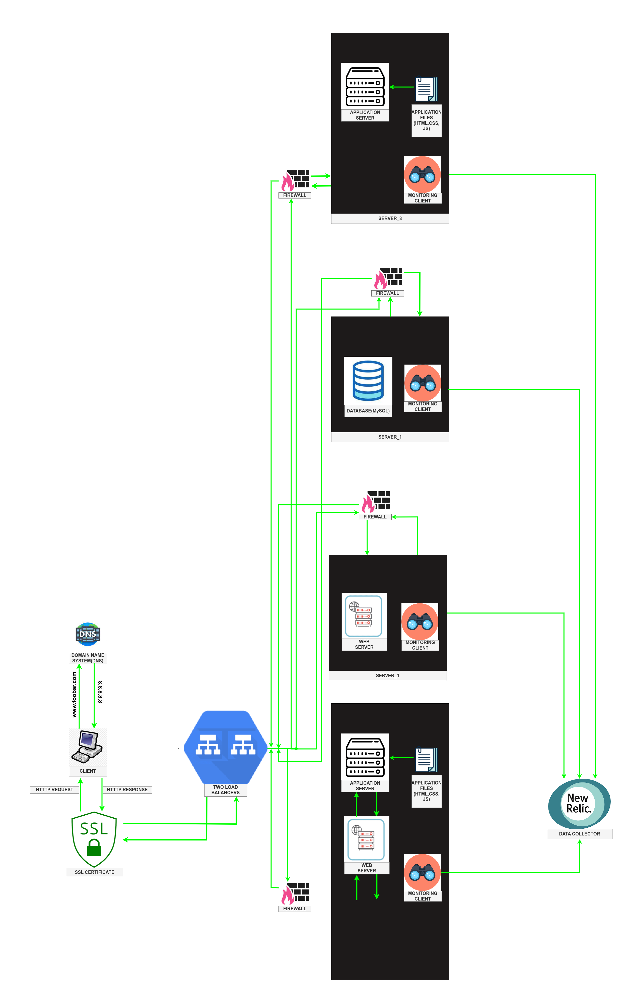

Scale Up

Sure! Let's incorporate the additional elements into the infrastructure and explain their purposes:

1. Load Balancer (HAProxy) Cluster:
By adding a load balancer cluster, we improve the availability and scalability of the infrastructure. The load balancer distributes incoming requests across multiple servers in a balanced manner, ensuring efficient resource utilization and preventing any single point of failure. The cluster configuration adds redundancy, allowing one load balancer to take over if another fails, thereby enhancing fault tolerance.

2. Split Components with Dedicated Servers:
To enhance performance, isolation, and scalability, we split the components (web server, application server, and database) onto separate dedicated servers:

- Web Server: A dedicated server hosts the web server software (such as Nginx or Apache). It handles incoming HTTP requests, serves static files, and acts as a reverse proxy to forward dynamic requests to the appropriate application servers.

- Application Server: Another dedicated server runs the application server software. It executes the website's code base, processes dynamic requests, and interacts with the database server to retrieve or store data.

- Database Server: A separate server is allocated to host the database (MySQL). It manages data storage, retrieval, and processing, ensuring efficient data management for the website.

Each component has its own server to enable independent scalability, isolation of resources, and better fault tolerance.

By adding the load balancer cluster and splitting the components with dedicated servers, we achieve the following benefits:

- Improved Availability: The load balancer cluster ensures high availability by distributing incoming requests across multiple servers. If one load balancer or server fails, the others continue to handle the traffic, minimizing downtime and ensuring uninterrupted service.

- Scalability: With separate servers for each component, we can scale each part independently based on its specific needs. For example, if the database requires more resources or the application server needs additional processing power, we can scale those components without affecting others.

- Performance Isolation: Splitting the components onto dedicated servers avoids resource contention. Each component can utilize the server's resources efficiently, preventing performance issues that may arise from sharing resources among multiple components.

- Fault-Tolerance: The load balancer cluster and separate servers mitigate the risk of a single point of failure. If one server fails, the load balancer redirects traffic to other available servers, ensuring the website remains operational.

By incorporating these elements, the infrastructure gains enhanced availability, scalability, performance isolation, and fault-tolerance, enabling it to handle increased traffic, provide better resource utilization, and improve overall reliability.